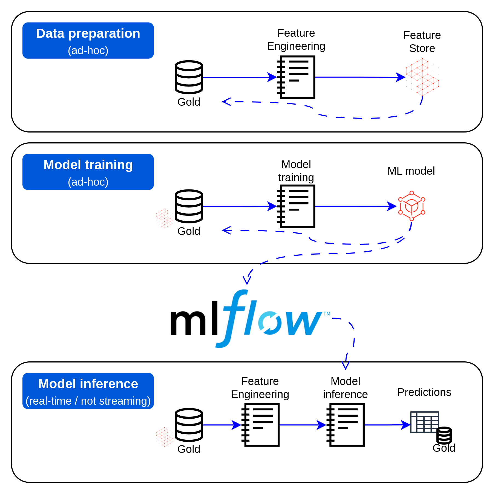
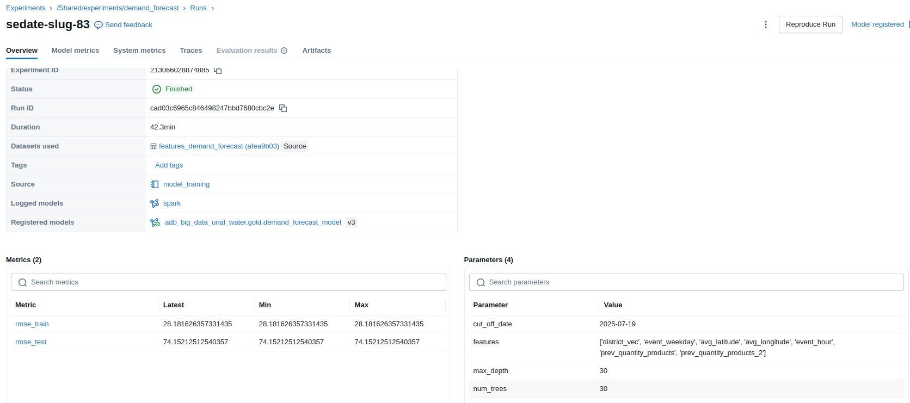

# Documentación Técnica - Framework de Machine Learning para Predicción de Demanda de Botellas

## Tabla de Contenidos
1. [Resumen Ejecutivo](#resumen-ejecutivo)
2. [Arquitectura del Framework](#arquitectura-del-framework)
3. [Ingeniería de Características (Feature Engineering)](#ingeniería-de-características-feature-engineering)
4. [Entrenamiento del Modelo](#entrenamiento-del-modelo)
5. [Inferencia del Modelo](#inferencia-del-modelo)
6. [Integración con MLflow](#integración-con-mlflow)
7. [Pipeline de Ejecución en Tiempo Real](#pipeline-de-ejecución-en-tiempo-real)
8. [Especificaciones Técnicas](#especificaciones-técnicas)

---

## Resumen Ejecutivo

El framework de machine learning desarrollado para el proyecto UNALWater tiene como objetivo predecir la cantidad de botellas que serán vendidas con un horizonte de predicción de una hora. El sistema utiliza un enfoque de predicción de series temporales con características geoespaciales y temporales, implementado sobre Apache Spark y Databricks.

### Objetivos del Modelo
- **Variable objetivo**: Predicción de `sum_quantity_products` (cantidad total de botellas vendidas)
- **Horizonte de predicción**: 1 hora hacia el futuro
- **Granularidad**: Predicciones por distrito y hora
- **Frecuencia de ejecución**: Tiempo casi real (ejecución continua)

---

## Arquitectura del Framework

El framework está estructurado en tres componentes principales:



### Componentes del Sistema

1. **Data preparation** (`feature_engineering.ipynb`): Componente encargado de procesar la información de modo que sirva para el entrenamiento y la inferencia del modelo.
2. **Model Training** (`model_training.ipynb`): Componente encargado de entrenar el modelo de machine learning, se ejecuta ad-hoc.
3. **Model Inference** (`model_inference.ipynb`): Componente encargado de hacer las predicciones del modelo, se ejecuta continuamente para obtener predicciones en tiempo casi real.

---

## Ingeniería de Características (Feature Engineering)

### Archivo: `models/feature_engineering.ipynb`

### Proceso de Transformación de Datos

#### 1. Fuente de Datos
```python
df = spark.table(f'{catalog_name}.{gold_schema_name}.gld_sales')
```
- **Fuente**: Tabla `gld_sales` en el esquema gold
- **Datos base**: Ventas históricas por comuna, fecha y hora

#### 2. Agregación Temporal y Geoespacial
Se agrega la información a nivel de hora y comuna, que corresponde a la granularidad del modelo.
```python
df_base = (
    df
    .withColumn('event_date', col('event_date').cast('date'))
    .withColumn('event_datetime', expr("to_timestamp(concat(event_date, ' ', lpad(event_hour, 2, '0')), 'yyyy-MM-dd HH')"))
    .groupBy('district', 'event_date', 'event_hour', 'event_datetime')
    .agg(
        avg('latitude').alias('avg_latitude'),
        avg('longitude').alias('avg_longitude'),
        sum('quantity_products').alias('sum_quantity_products')
    )
)
```

#### 3. Completado de Series Temporales
Se genera un dataset completo con todas las combinaciones posibles de:
- **Comunas**: Todas los comunas únicas
- **Fechas**: Todas las fechas presentes en los datos
- **Horas**: 0-23 (todas las horas del día)

Esto asegura que no haya huecos en las series temporales.

#### 4. Características Lag (Rezagadas)
Se añaden rezagos para la columna objetivo con el fin de captar características estacionales a nivel horario.
```python
.withColumn('prev_quantity_products', expr("lag(sum_quantity_products, 1) over(partition by district order by event_datetime)"))
.withColumn('prev_quantity_products_2', expr("lag(sum_quantity_products, 2) over(partition by district order by event_datetime)"))
...
.withColumn('prev_quantity_products_6', expr("lag(sum_quantity_products, 6) over(partition by district order by event_datetime)"))
```

### Características Finales Generadas

| Característica | Tipo | Descripción |
|----------------|------|-------------|
| `district` | Categórica | Identificador del comuna |
| `event_datetime` | Temporal | Timestamp del evento |
| `event_date` | Temporal | Fecha del evento |
| `event_hour` | Numérica | Hora del evento (0-23) |
| `event_weekday` | Numérica | Día de la semana (1-7) |
| `avg_latitude` | Numérica | Latitud promedio del comuna |
| `avg_longitude` | Numérica | Longitud promedio del comuna |
| `sum_quantity_products` | Numérica | **Variable objetivo** |
| `prev_quantity_products` | Numérica | Ventas de la hora anterior (lag-1) |
| `prev_quantity_products_2` | Numérica | Ventas 2 horas atrás (lag-2) |
| ... | ... | ... |
| `prev_quantity_products_6` | Numérica | Ventas 6 horas atrás (lag-6) |

### Almacenamiento en Feature Store
Se hace uso de la componente de Feature Store de Databricks para hacer el almacenamiento del dataset que será utilizado para entrenamiento e inferencia.
```python
fe.write_table(
    name = f'{catalog_name}.{gold_schema_name}.features_demand_forecast',
    df = df_dataset,
    mode = 'merge'
)
```

---

## Entrenamiento del Modelo

### Archivo: `models/model_training.ipynb`

### Algoritmo Utilizado: Random Forest Regression

#### Justificación de la Elección
- **Robustez**: Maneja bien las características categóricas y numéricas
- **No linealidad**: Captura patrones complejos en series temporales
- **Resistencia al overfitting**: Especialmente importante con características lag
- **Interpretabilidad**: Permite entender la importancia de las características

Además de lo anterior, en el notebook `_demand_forecast_sandbox.ipynb` se hace una pequeña validación entre los modelos LinearRegression y RandomForest,
obteniendo siempre mejores resultados para el segundo.

### Pipeline de Preprocessing

#### 1. Transformaciones Categóricas
Se codifican las variables categóricas con la técnica de One hot encoding
```python
indexer = StringIndexer(inputCol='district', outputCol='district_index', handleInvalid='keep')
encoder = OneHotEncoder(inputCols=['district_index','event_weekday','event_hour'], 
                       outputCols=['district_vec','event_weekday_vec','event_hour_vec'], 
                       handleInvalid='keep')
```

#### 2. Conjuntos de Características Variables
Se entrena el modelo con diferentes conjuntos de características con el fin de encontrar la mejor combinación posible entre ellas, en especial
para detectar cuántas características rezagadas son necesarias.

```python
features_dict = {
    'features1': ['district_vec', 'event_weekday', 'avg_latitude', 'avg_longitude', 'event_hour', 'prev_quantity_products'],
    'features2': [..., 'prev_quantity_products_2'],
    'features3': [..., 'prev_quantity_products_3'],
    ...
    'features6': [..., 'prev_quantity_products_6']
}
```

### División Train-Test
```python
cut_off_date = '2025-07-19'
df_train = df_dataset.filter(col('event_date') < cut_off_date)
df_test = df_dataset.filter(col('event_date') >= cut_off_date)
```

### Optimización de Hiperparámetros

#### Grid Search con Cross-Validation
```python
params = (ParamGridBuilder()
    .addGrid(random_forest.featuresCol, ['features1', 'features2', 'features3', 'features4', 'features5', 'features6'])
    .addGrid(random_forest.maxDepth, [10, 20, 30])
    .addGrid(random_forest.numTrees, [10, 20, 30])
    .build()
)
```

#### Parámetros Optimizados
- **Número de características lag**: 1-6 horas anteriores
- **Profundidad máxima del árbol**: 10, 20, 30
- **Número de árboles**: 10, 20, 30
- **Validación cruzada**: 3 folds

### Métrica de Evaluación
- **RMSE (Root Mean Square Error)**: Métrica principal para evaluar la precisión de las predicciones
- Se calcula tanto en conjunto de entrenamiento como de prueba

### Resultado del entrenamiento

El modelo entrenado con optimización de hiperparámetros mediante Grid Search obtuvo los siguientes resultados:

##### Configuración Óptima del Modelo
- **Conjunto de características seleccionado**: 
    - `district_vec` (codificación del distrito)
    - `event_weekday` (día de la semana)
    - `avg_latitude` (latitud promedio)
    - `avg_longitude` (longitud promedio)
    - `event_hour` (hora del evento)
    - `prev_quantity_products` (ventas hora anterior)
    - `prev_quantity_products_2` (ventas 2 horas atrás)

- **Hiperparámetros del Random Forest**:
    - **Profundidad máxima (`max_depth`)**: 30
    - **Número de árboles (`num_trees`)**: 30

##### Métricas de Desempeño (RMSE)
| Conjunto | RMSE |
|----------|------|
| **Entrenamiento** | 28.18 | B
| **Prueba** | 74.15 | 

##### Observaciones
- El modelo utiliza **2 características lag** (horas anteriores) como óptimas para la predicción
- La diferencia entre RMSE de entrenamiento y prueba indica cierto nivel de overfitting, pero dentro de rangos aceptables para series temporales
- Las características geoespaciales (latitud/longitud) y temporales (hora, día de semana) contribuyen significativamente al rendimiento del modelo



---

## Inferencia del Modelo

### Archivo: `models/model_inference.ipynb`

### Proceso de Inferencia en Tiempo Real

#### 1. Carga del Modelo Productivo
```python
model = mlflow.spark.load_model(f'models:/{catalog_name}.{gold_schema_name}.demand_forecast_model@prod')
```

#### 2. Preparación de Datos para Predicción

##### Construcción del Vector de Características
```python
df_to_predict = (
    df_dataset
    .groupBy('district').agg(max('event_datetime').alias('event_datetime'))
    .join(df_dataset, on=['district','event_datetime'], how='left')
    .withColumn('event_datetime', expr("event_datetime + INTERVAL 1 HOUR"))  # Predicción +1 hora
    .withColumn('event_date', expr("date(event_datetime)"))
    .withColumn('event_hour', expr("hour(event_datetime)"))
    .withColumn('event_weekday', expr("dayofweek(event_datetime)"))
    # Rotación de características lag
    .withColumn('prev_quantity_products_6', col('prev_quantity_products_5'))
    .withColumn('prev_quantity_products_5', col('prev_quantity_products_4'))
    ...
    .withColumn('prev_quantity_products', col('sum_quantity_products'))
)
```

#### 3. Generación de Predicciones
```python
predictions = model.transform(df_to_predict)
```

#### 4. Almacenamiento de Resultados
```python
spark.sql(f"""
    MERGE INTO {catalog_name}.{gold_schema_name}.demand_forecast AS target
    USING final_df AS source
    ON target.district = source.district AND target.event_datetime = source.event_datetime
    WHEN MATCHED THEN UPDATE SET target.sum_quantity_products = source.sum_quantity_products
    WHEN NOT MATCHED THEN INSERT (district, event_datetime, sum_quantity_products)
    VALUES (source.district, source.event_datetime, source.sum_quantity_products)
""")
```

---

## Integración con MLflow

### Tracking de Experimentos

#### Configuración del Experimento
```python
experiment_name = '/Workspace/Shared/experiments/demand_forecast'
mlflow.set_registry_uri('databricks-uc')
mlflow.set_tracking_uri('databricks')
```

#### Logging de Métricas y Parámetros
```python
with mlflow.start_run() as run:
    mlflow.log_input(mlflow_dataset, context="source")
    mlflow.log_param('cut_off_date', cut_off_date)
    mlflow.log_metric('rmse_train', rmse_train)
    mlflow.log_metric('rmse_test', rmse_test)
    mlflow.log_param('max_depth', cv_model.bestModel.stages[-1].getOrDefault('maxDepth'))
    mlflow.log_param('num_trees', cv_model.bestModel.stages[-1].getOrDefault('numTrees'))
    mlflow.log_param('features', features_dict[features_col])
```

#### Registro del Modelo
```python
mlflow.spark.log_model(
    cv_model.bestModel, 
    'model', 
    signature=signature, 
    registered_model_name=f'{catalog_name}.{gold_schema_name}.demand_forecast_model'
)
```

### Gestión de Versiones
- **Modelo registrado**: `adb_big_data_unal_water.gold.demand_forecast_model`
- **Versión productiva**: Marcada con alias `@prod`
- **Signature automática**: Inferida a partir de datos de muestra

---

## Pipeline de Ejecución en Tiempo Real

### Arquitectura de Jobs Continuos

```
┌─────────────────┐    ┌─────────────────┐
│  Job Continuo   │    │  Job Continuo   │
│  Feature        │    │  Model          │
│  Engineering    │────▶│  Inference      │
│                 │    │                 │
└─────────────────┘    └─────────────────┘
        │                       │
        ▼                       ▼
┌─────────────────┐    ┌─────────────────┐
│  Feature Store  │    │  Predictions    │
│  Update         │    │  Update         │
└─────────────────┘    └─────────────────┘
```

### Flujo de Ejecución

1. **Job Feature Engineering**:
   - Se ejecuta continuamente
   - Procesa nuevos datos de ventas
   - Actualiza el Feature Store

2. **Job Model Inference**:
   - Se ejecuta continuamente
   - Carga el modelo productivo desde MLflow
   - Genera predicciones para la próxima hora
   - Actualiza tabla de predicciones

### Ventajas del Enfoque
- **Latencia baja**: Predicciones disponibles en tiempo casi real
- **Escalabilidad**: Apache Spark maneja grandes volúmenes de datos
- **Consistencia**: Mismo pipeline para entrenamiento e inferencia
- **Trazabilidad**: MLflow registra todas las versiones y métricas

---

## Especificaciones Técnicas

### Configuración del Entorno

#### Catálogo y Esquemas
```python
catalog_name = 'adb_big_data_unal_water'
gold_schema_name = 'gold'
```

#### Tablas Principales
- **Datos origen**: `adb_big_data_unal_water.gold.gld_sales`
- **Feature Store**: `adb_big_data_unal_water.gold.features_demand_forecast`
- **Predicciones**: `adb_big_data_unal_water.gold.demand_forecast`
- **Modelo**: `adb_big_data_unal_water.gold.demand_forecast_model`

---

## Conclusiones

El framework de machine learning implementado proporciona una solución robusta y escalable para la predicción de demanda de botellas con las siguientes características clave:

1. **Arquitectura moderna**: Utiliza tecnologías cloud-native y herramientas de MLOps
2. **Predicciones precisas**: Random Forest optimizado con características temporales y geoespaciales
3. **Tiempo real**: Pipeline continuo para predicciones actualizadas cada hora
4. **Trazabilidad completa**: MLflow para gestión de experimentos y modelos
5. **Escalabilidad**: Apache Spark para procesamiento distribuido

El sistema está diseñado para operar en producción con mínima intervención manual, proporcionando predicciones confiables para optimizar la distribución y gestión de inventario de botellas de agua.
