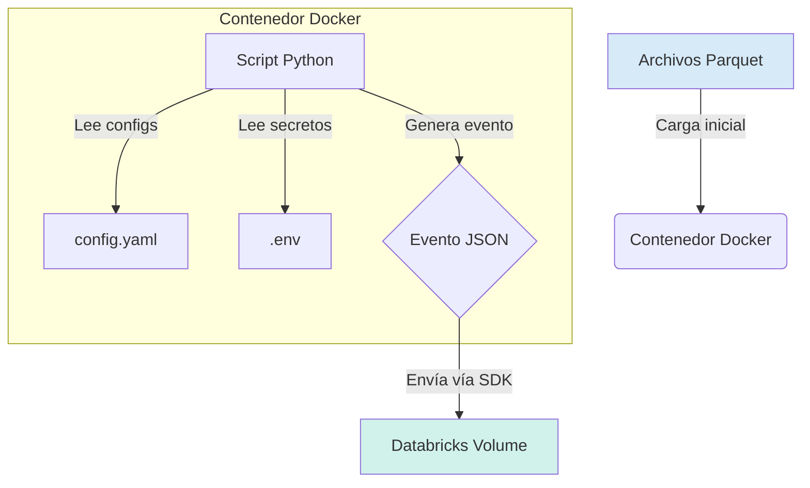

# Generador de Datos Sintéticos para Databricks

Este proyecto consiste en un servicio en Python, containerizado con Docker, que genera eventos sintéticos en formato JSON y los envía en tiempo real a un Volumen de Databricks. Está diseñado para simular una ingesta de datos continua, ideal para pruebas de pipelines de streaming, demos o desarrollo de soluciones de datos.

## Tabla de Contenidos
- [Arquitectura](#arquitectura)
- [Características Principales](#características-principales)
- [Estructura del Evento JSON](#estructura-del-evento-json)
- [Prerrequisitos](#prerrequisitos)
- [Instalación y Configuración](#instalación-y-configuración)
  - [1. Clonar el Repositorio](#1-clonar-el-repositorio)
  - [2. Datos de Entrada](#2-datos-de-entrada)
  - [3. Variables de Entorno](#3-variables-de-entorno)
  - [4. Archivo de Configuración](#4-archivo-de-configuración)
- [Uso](#uso)
  - [Iniciar el Generador](#iniciar-el-generador)
  - [Detener el Generador](#detener-el-generador)
- [Estructura del Proyecto](#estructura-del-proyecto)

## Arquitectura

El flujo de trabajo del generador es el siguiente:


1.  **Carga Inicial:** Al arrancar, el script carga datos estáticos desde archivos Parquet locales (IDs de clientes, empleados y coordenadas de un polígono; perímetro Medellín).
2.  **Generación Continua:** En un bucle infinito (simulando un evento de streaming), el script genera un registro JSON con datos aleatorios basados en la información inicial.
3.  **Envío a Databricks:** Cada registro generado se envía como un archivo `.json` individual a un Volumen de Databricks especificado, utilizando el SDK de Databricks para la autenticación y la carga.

## Características Principales

- **Generación Sintética:** Crea datos realistas simulando eventos de órdenes o transacciones.
- **Configurable:** El intervalo de envío y la ruta de destino en Databricks se pueden configurar en tiempo real.
- **Containerizado:** Empaquetado con Docker y orquestado con Docker Compose para un despliegue sencillo y consistente.
- **Integración con Databricks:** Utiliza el SDK oficial de Databricks para una comunicación segura y eficiente con los Volúmenes de Databricks.
- **Extensible:** Diseñado para ser fácilmente modificable y añadir nuevos campos o lógicas de generación.

## Estructura del Evento JSON

Cada evento enviado a Databricks tiene la siguiente estructura en formato JSON:

```json
{
    "latitude": 40.416775,
    "longitude": -3.703790,
    "date": "12/05/2024 10:43:19",
    "customer_id": "CUST-12345",
    "employee_id": "EMP-67890",
    "quantity_products": 42,
    "order_id": "a1b2c3d4-e5f6-7890-1234-567890abcdef"
}
```

## Prerrequisitos

- Docker instalado y en ejecución.
- Acceso a un workspace de Databricks.
- Un **Personal Access Token (PAT)** de Databricks con permisos para escribir en Volúmenes.
- Un Volumen creado en Databricks para recibir los datos.

## Instalación y Configuración

Siga estos pasos para poner en marcha el generador.

### 1. Clonar el Repositorio

```bash
git clone https://github.com/Ezapataq07/BigData_Project_UNALWater.git
cd BigData_Project_UNALWater/generador
```

### 2. Datos de Entrada

El generador requiere datos iniciales para funcionar. En la carpeta `data/` se encuentran los archivos Parquet por defecto.

- `data/clientes.parquet`: Debe contener una columna con los IDs de los clientes `customer_id`.
- `data/empleados.parquet`: Debe contener una columna con los IDs de los empleados `employee_id`.
- `data/poligono.parquet`: Debe contener las coordenadas que definen el área geográfica para generar ubicaciones.

### 3. Variables de Entorno

La autenticación con Databricks se gestiona a través de variables de entorno para mantener la seguridad de las credenciales.

Cree un archivo llamado `.env` en la raíz del proyecto a partir del ejemplo proporcionado:

```bash
cp .env.example .env
```

Ahora, edite el archivo `.env` y complete los valores:

```ini
# .env
# URL del workspace de Databricks
DATABRICKS_HOST="[WORKSPACE_URL]"

# Personal Access Token de Databricks
DATABRICKS_TOKEN="[PAT_DE_DATABRICKS]"
```

### 4. Archivo de Configuración

Los parámetros de comportamiento del script se definen en `config.yaml`. Se pueden ajustar estos valores según las necesidades.

```yaml
# producer_configs.yaml

# Ruta base en el Volumen de Databricks donde se guardarán los archivos JSON.
# Formato: /Volumes/<catalog>/<schema>/<volume_name>/<optional_path>/
dbfs_dest_path_base: "/Volumes/main/default/mi_volumen_de_ingesta/my_app_data/"

# Intervalo en segundos entre el envío de cada evento.
upload_interval_seconds: 30
```

## Uso

### Iniciar el Generador

Una vez completada la configuración, inicie el servicio con Docker Compose. El comando `--build` se asegura de reconstruir la imagen si ha habido cambios en el código.

```bash
docker compose up --build
```

Para ejecutarlo en segundo plano (modo detached):

```bash
docker compose up --build -d
```

Se veran los logs en la consola indicando que el generador ha iniciado y está enviando datos.

### Detener el Generador

Para detener el servicio, presione `Ctrl + C` en la terminal donde se está ejecutando. Si se está ejecutando en modo detached, use:

```bash
docker compose down
```

## Estructura del Proyecto

```
.
├── data/
│   ├── clientes.parquet      # (Datos iniciales)
│   ├── empleados.parquet     # (Datos iniciales)
│   └── 50001.parquet         # (Datos iniciales)
├── config/
│   └── producer_configs.py   # Archivo de configuración de la aplicación
├── src/
│   └── producer_api.py       # Script principal del generador de datos
├── .env.example              # Plantilla para variables de entorno        
├── docker-compose.yml        # Orquestador de Docker
├── Dockerfile                # Definición de la imagen de Docker
├── requirements.txt          # Dependencias de Python
└── README.md                 # Documentación
```
